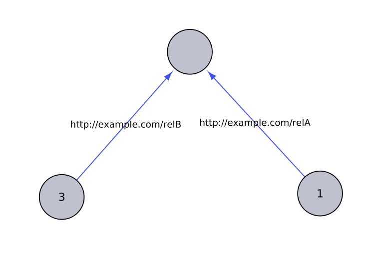

# Graph-tool Property Graph

Library for creation and management of graphs with vertex and edge properties,
uses [Graph-tool](https://graph-tool.skewed.de/) as the underlying graph library.
_gt-pg_ library also allows to access graph-tool objects.

# Quickstart

Graph-tool Property Graph is available on custom CLARIN PyPI repository and can be
installed with [pip](https://pip.pypa.io).

```bash
$ pip install --ignore-installed --extra-index-url https://pypi.clarin-pl.eu/ gt-pg
```

After installing Graph-tool Property Graph you can use it like any other
Python module.

Here is a simple usage demonstrating usage of gt-pg package
([quickstart.py](examples/quickstart.py)):

```python
import gt_pg

# prepare data for simple graph:
# prepare names of properties of certain types
vertex_properties = {
    "uri": "string",
    "label": "string",
}
edge_properties = {
    "uri": "string",
    "label": "string",
}

# prepare values for uris, the keys for vertices and edges
v_id_prop = "uri"
e_id_prop = "uri"
v_uris = ["http://example.com/1", "http://example.com/2", "http://example.com/3"]
e_uris = ["http://example.com/relA", "http://example.com/relB"]

# initialize the graph
g = gt_pg.Graph()
g.init_graph(
    v_props=vertex_properties,
    e_props=edge_properties,
)
g.set_vertex_id_prop(v_id_prop)
g.set_edge_id_prop(e_id_prop)

# specify properties for vertices, vertices will be created
g.append_vprop_val(v_uris[0], "label", "1")
g.append_vprop_val(v_uris[2], "label", "3")

# create relation between vertices, non-existing vertices will be created
g.create_relation(v_uris[0], v_uris[1], e_uris[0])
g.create_relation(v_uris[2], v_uris[1], e_uris[1])

# specify property for edge
g.append_eprop_val(v_uris[2], v_uris[1], "label", "relA")

# save graph
g.save('quickstart.graphml')
```

Above snippet generates following graph:   



# Acknowledgements
Project structure generated from cookiecutter template
[cookiecutter-python-project](https://github.com/claws/cookiecutter-python-project)
